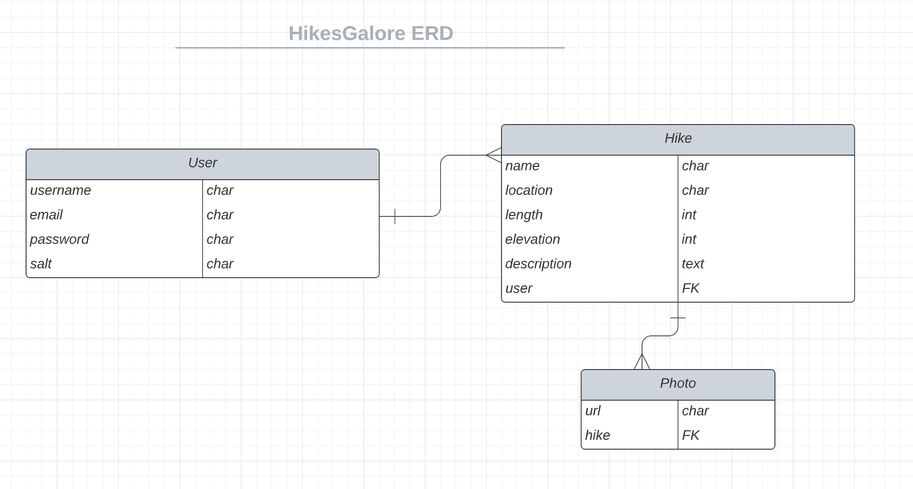

# Current Project: HikesGalore, A Hike Tracker App :mountain:

## Description

For all my outdoorsy friends who love to go on hikes - this app is for you! Keep track of your favorite hikes using this app. Log the name of the hike, location, length, elevation gain, and a brief description if you'd like. Even upload a pic or two for that hike if you desire.

## ERD

### Technologies Used:

1. Python3
2. Django
3. PostgreSQL
4. HTML
5. CSS
6. AWS
7. Materialize

### Currently Working On:

- Setting up Google Maps API to show where exactly the hike location is
